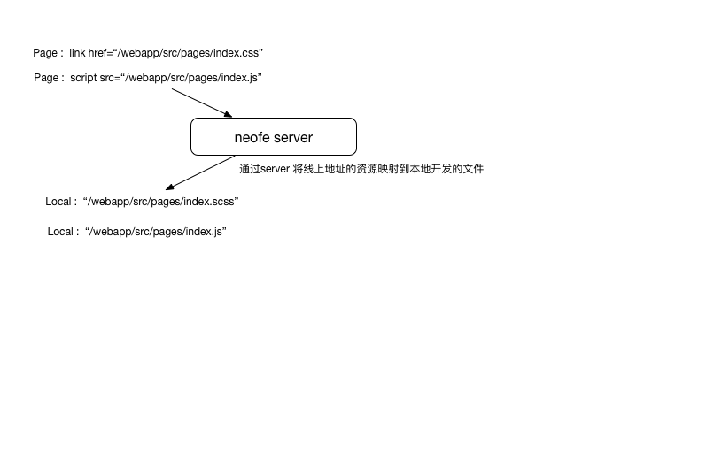

# neofe

前端调试编译开发工具。Gulp + Browserify 二次开发 。

a tool for fe developer

Install

    npm install -g neofe

Usage :

    neofe --help

### Usage: neofe [command] {OPTIONS}

    Command :

    server  本地启动一个服务器 ,通过这个服务器可以将打包混淆的css 或者 js 文件解析
            为本地开发中的文件。
            start a server for develop.
            a minify  css or js file can map a local file by the server.

            Options :

            --port, -p,  a port of the server. default 8998;
                         本地启动服务的端口号 . 默认 8998.

    pack   仅打包，并不压缩和生存版本号 便于发布到DEV环境与产品人员调试
           just pack not min and create version

    build  根据package.json 构建项目 比如打包 压缩 混淆 CSS 或者 JS 文件 。
           as follow the package.json build the project  (pack, compress ,and minify css or js file);

    deploy  deploy builded files  to the online  server .
            将构建后的file 发布到线上服务器. 一般应该用 jenkins.

            Options :
            --task , -t neofe deploy -t cc -d beta  将css/js 文件发布到Beta环境。
            --dest , -d 目标环境  dev / beta / prd

    init   在当前目录创建一个 neofe.config 文件
           create neofe.config in proccess.cwd() path

    show_common_deps  从多个文件中提取公共依赖
                      find multiple files dependent module
                      Opitons :
                      --file , -f  需要提取的文件地址
                      --file_config, -c  多个文件可以用高配置
                      --help , -h  show help

    Options :

    --help , -h  show help
    --version, -v show neofe version

### `expample`  [Example 示例](https://github.com/imvvk/neofe-example)

### `neofe.config` 介绍

    {
      "browserify": {
        "options": {
          "paths": [],
          "external": [],
          "extensions": [],
          "transform": []
        }
        "containCss" : false,
        "outCss" : false
      },
      "exports": {
        "basedir": "./",
        "baseHtmlDir" : "./",
        "baseSourceDir" : "./",
        "scripts": ["./src/scripts/exports/**/*.js"],
        "styles": ["./src/styles/exports/**/*.scss"],
        "htmls": ["./html/**/*.html"],
        "sources" : ["./images/**"]
        "minify" : {
          "script" : {},
          "style" : {},
          "html" : {}  
        }
      },
      "server": {
        "parseFileType": ["css", "js", "html"]
      },
      "buildPath": "./build",
      "buildHtmlPath" :  "./buildHtml",
      "buildSourcePath" : "./buildSourcePath",
      "packPath": "./pack",
      "packHtmlPath" : "./packHtml",
      "packSourcePath" : "./packSoucePath",
      "verpath": "./ver",
      "deploy": {
        "static": {
          "src": "./build/src/",
          "dest": "/home/www/static/",
          "username": "xxx",
          "exclude": [".git", ".svn"],
          "host": {
            "dev" : "10.0.0.1",
            "beta": "10.0.0.1",
            "prd" : "10.0.0.1"
          }
        }
      }
    }

** 为了兼容老版本，也可以在package.json里写入配置文件，区别仅仅是exports 要写在 browserify 里面 **
** Config  could in package.json for hack old version **

### Package.json Example

    {
        "browserify" : {
          "options" : {
            "transform" : ["juicerify"],
            "paths" : [],
            "external" : [],
            "extensions" : [".tmpl"]
          },
          "exports" : {
            "basedir": "./",
            "scripts": ["./src/scripts/exports/**/*.js"],
            "styles": ["./src/styles/exports/**/*.scss"],
            "htmls": ["./html/**/*.html"]
          }
        },
        "server": {
          "parseFileType": ["css", "js", "html"]
        },
        "buildPath": "./build",
        "verPath": "./ver",
        "deploy": {
          "static": {
            "src": "./build/src/",
            "dest": "/home/www/static/",
            "username": "xxx",
            "exclude": [".git", ".svn"],
            "host": {
              "dev" : "10.0.0.1",
              "beta": "10.0.0.1",
              "prd" : "10.0.0.1"
            }
          }
        }
    }

### 配置文件介绍  Config

`browerify` 属性下的详细配置  

    options 是browserify 配置需要的options，以下为options 详细说明   
         path 目录数组,表示require 时不使用相对路径的模块的查找路径，例如:["./src/libs"] require("cookie") 时，会从node_modules 和 src/libs 里查找，node_modules 是默认查找的路径.  
         require  外部require 的模块数组, 一般不使用，特殊情况下require 外部资源作为公共模块使用.  
         external 需要剔除的外部模块数组，比如React  Angular jQuery 这种体积较大的模块  
         transform  browerify 转换数组 [browserify transform list](https://github.com/substack/node-browserify/wiki/list-of-transforms)   

    containCss 为 true 表示 样式文件(例如：css scss) 将被打包为 module.epxorts="{{文件内容}}",一般此模式用于
    requireJs 项目引用styles 输出到页面 。否则将被独立输出为一个CSS文件。  

    outCss 表示pack 或者 build 时输出与js 同名的css 文件  

    globalExpose {Object} 整个项目全局映射的 expose 配置

`exports` 详细配置

    scripts : 脚本输出配置 array or string 如果是String 仅指一个文件 "path/file"

    styles: 样式输出配置 array or string  如果是String 仅指一个文件 "path/file"

    htmls: html 输出文件 执行build 命令时 会对html 的 link href script src 进行版本号替换

    source : 不需要转化的但是需要构建到发布文件夹的 比如images 方便发布使用。

    basedir:  针对 scritps 和 styles 打包时的 base 目录,会以应用于 gulp src options 的base 属性

    htmlBaseDir: html 输出base目录 以应用于 gulp src options 的base 属性
    htmlSourceDir: source  输出base目录 以应用于 gulp src options 的base 属性

    minify 文件压缩配置 js 用 uglifyjs 压缩 ， css用clean css 压缩 ，script 和 style 为各自配置  html 用gulp-htmlmin 配置

    insertManifest 默认是 false  如果是true 会在html 的head 里插入 script 脚本  
       
         ;

    输出文件介绍：
    scripts 里文件配置介绍 ：
    注意：项目的输出文件，在server 启动中只有符合 exports glob的请求才会被解析，
    请求文件在也就是exports 中的 scripts styles里有配置才可以被解析。

    {file : "path/file" ,isParent:false, parents: undefined, expose: undefined , outCss : false ,containCss : false }
    可以简写为 "path/file"

    isParent : 是另外一个export 文件的前置加载js 文件 true  表示此文件中的模块都会对外暴露出来，可以让子文件require

    parents: 此文件所有的前置加载文件 ，此文件的依赖如果存在于parents中则不被打包到此文件中。而是从父文件中依赖取得。

    require 子文件的browserfiy 配置 会覆盖全局的 配置
    external 子文件的browserfiy 配置 会覆盖全局的 配置

    默认值
    expose 默认为 undefined 一般用于生成外部模块 或者 异步加载JS 时，对外暴露名称。
    outCss false
    containCss false

    minify 配置说明

    minify  : {
       "script" : {
         "mangle": {
           "except": ["$super"]
         }
       },
       "style" : {

       },
       "html" :{}
     }

`buildPath`  build 执行时 exports 中的 scripts styles 的输出目录

`buildHtmlPath`  build 执行时 exports 中的 htmls 的输出目录

`buildSourcePath`  build 执行时 exports 中的 sources 的输出目录

`packPath`  pack 执行时 exports 中的 scripts styles 的输出目录

`packHtmlPath`  pack 执行时 exports 中的 scripts styles 的输出目录

`packSourcePath`  pack 执行时 exports 中的 scripts styles 的输出目录

`fePrefix` Array 数组类型 ["someproject", "src/"]   

`server` 有关neofe server 的相关配置 
    parseFileType : [] 设定那些文件将被server 解析 除此之外的文件都被会直接返回。 

"verpath": "./ver"  版本号文件输出目录 里面含有 manifest.json 文件

### Example 介绍

    cd expample

    neofe server

    访问: http://127.0.0.1:8998/webapp/index.html

pages index.js 内容：

    //加载模块内容
    var mod = require("../mods/mod.js");
    window.onload = function() {
      mod.render("mod_container");
      document.getElementById("logic").innerHTML = '
 this is logic content
';
    }

pages index.scss

    require("./page.scss");
    require("./index.js"); //将js 中引用css|scss 的文件提取出来 打包合并

index.scss 文件不可以混合使用 sass 语法 和 require ， 因为每个
require文件会走brwoserfiy 的分析， 然后再经过 sass transform
生成css 内容，如果混合使用则不能通过 browserify 语法校验。

==========================
1.1.10   
    增加html压缩 配置  neofe.config 中exports 的minify 中增加 html : {  @options }  
    options 说明见[html-minifier](https://github.com/kangax/html-minifier)  
    增加 neofe pack html   和 neofe build html 单独处理html 版本替换 (pack 或 build 之后使用 , 调试用)  
    config  新增 buildHtmlPath 指定 html的目的目录默认为 buildPath  

1.1.12  
    deploy命令增加 --not-promt  参数 neofe deploy -t taskname -d dest_name --not-promt 不提示confirm 信息  
    配置文件deploy 设置 增加hostname 为数组 可以向多个服务器sync   
    配置文件新增 buildHtmlPath 可以指定html 的输出地址  
    配置文件exports 中新增 staticReg 可以配置需要替换的 version src 或者 href  内容  
    html replace version 增加日志输出  

1.1.15   
    exports 增加sources可以将image swf 等资源移动到相应的build目录 ,config  新增 buildSourcePath 指定 source的目的目录默认为 buildPath  

    exports : {
        "sourceBaseDir" : "xxxx/path",
        "sources" : ["xxx/path/**/*.*"]
    },
    buildSourcePath : "abc/path"

1.1.18
    打包时增加 参数可以不加版本号    

    neofe build --noversion
    neofe pack --noversion

1.1.20 
    增加  exports中的导出资源增加  require external  配置 独立打包 灵活配置 

    
